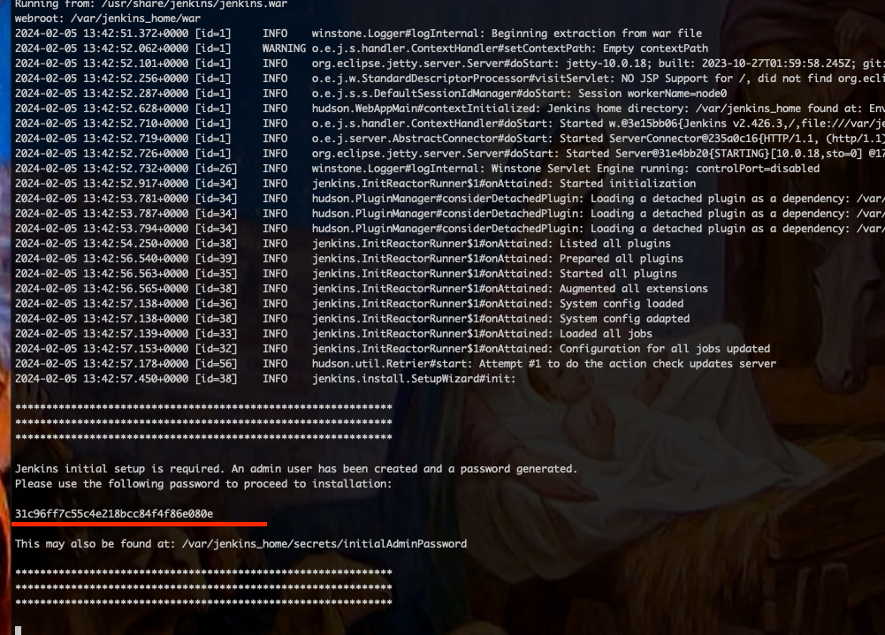
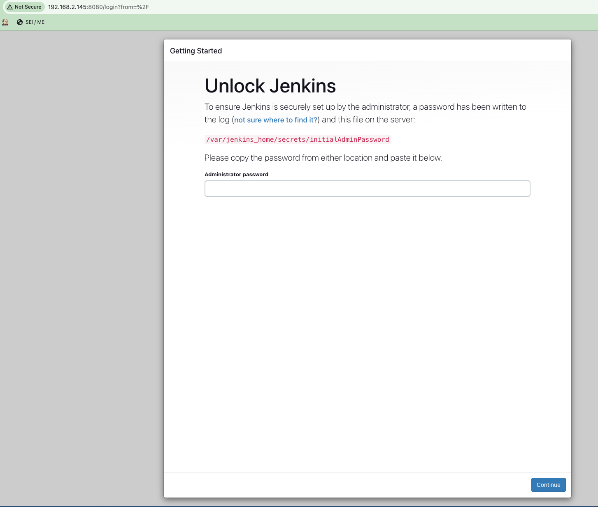
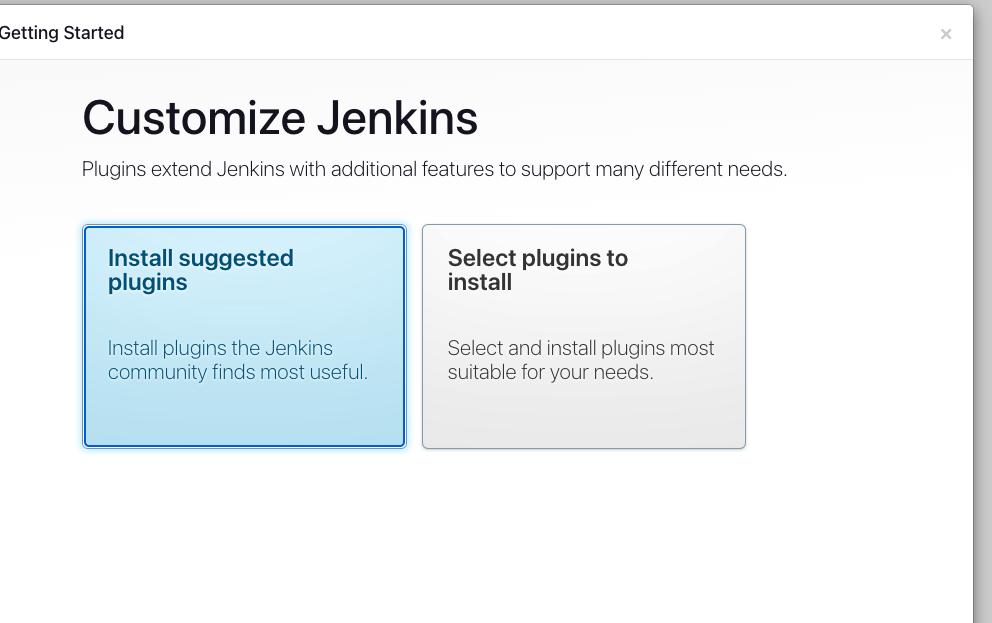
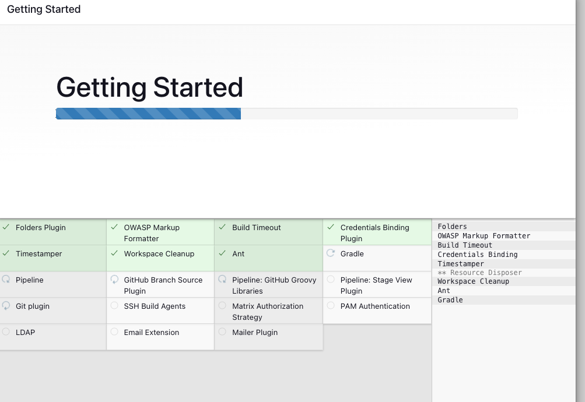
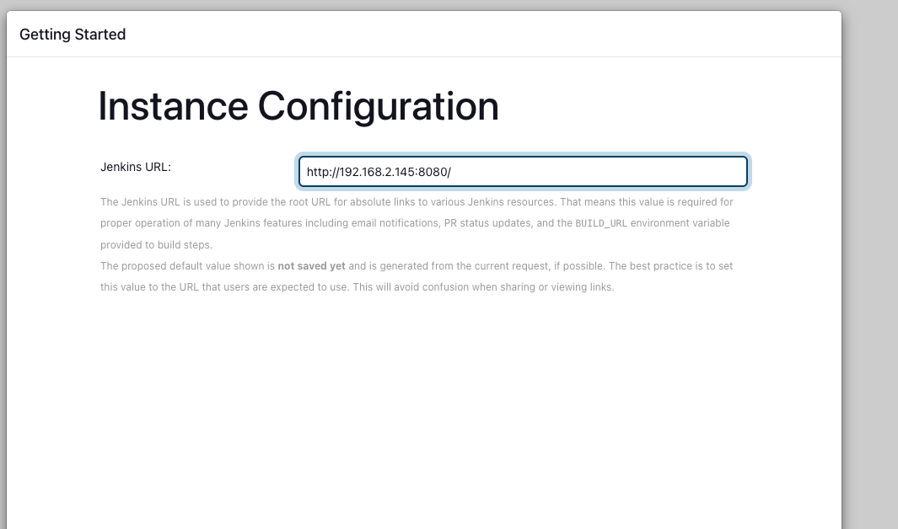
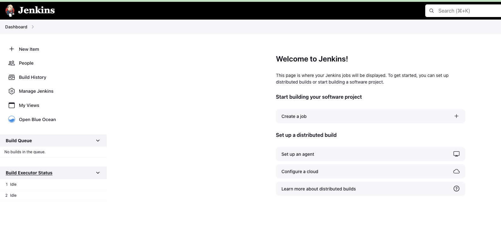

# Imagem Jenkins

## Para buildar:

```
docker build -t pengovbr/jenkins:1.0 .
```
substitua pengovbr... pelo nome a sua escolha.

## Para subir:

- Vamos criar um volume
```
docker create --name=myjenkinsvol -v /var/jenkins_home busybox
```
- Rodar o conteiner
```
docker run -d --privileged --user=root --env="TZ=America/Sao_Paulo" --name=myjenkins --restart=always --volumes-from=myjenkinsvol -v /var/run/docker.sock:/var/run/docker.sock -p "8080:8080" -p "50000:50000" pengovbr/jenkins:1.0
```

- Acompanhar os logs
```
docker logs -f myjenkins
```

- copie a chave de instalação que irá aparecer nos logs




- Acessar interface e finalizar a instalação

copie a chave e continue


instale os plugins sugeridos


Aguarde a instalaçã


Defina um nome para sua instalação. Garanta que esse nome/endereço seja acessível





Pronto! Jenkins no ar agora vamos passar a parte de criar e pré-popular os segredos e os jobs.

